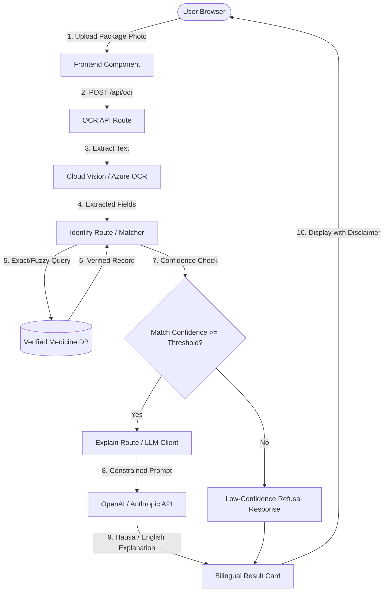
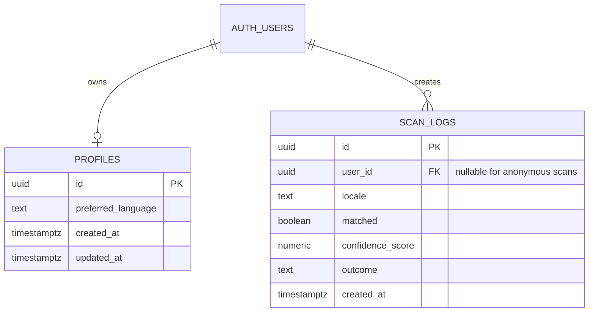
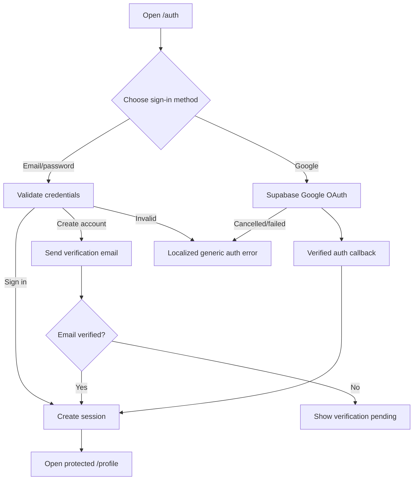

# MEDORA: Web Platform Prototype Implementation Plan

> **Product**: MEDORA (Understand Your Medicine, in Your Language)  
> **Proposed By**: Jamil Muhammad Abdullahi, CTO, Chosen Technologies  
> **Author**: RahinatuHumaiza Hassan  
> **Date**: 18 September 2026 | **Version**: 1.0 (Prototype Scope)  
> **Platform**: Web-Facing Platform First (Next.js + TypeScript + Tailwind CSS)

---

## User Review Required

> [!IMPORTANT]
> **Safety Guardrail & Refusal Integrity**: The core loop (Upload $\rightarrow$ OCR $\rightarrow$ Match $\rightarrow$ Constrained LLM Explanation) **MUST NEVER** invent results or hallucinate medicine names when match confidence is low. Diagnostic, dosage, or authenticity questions must trigger automatic refusal.
> 
> **Clinical Content Accuracy**: All Hausa translations and simplified clinical text for the 5–10 seed medicines must be verified against source documentation. Machine translation alone is not permitted for clinical content.

> [!WARNING]
> **Transient Storage Policy**: Images uploaded by users are processed transiently in memory or short-lived storage and discarded immediately after processing to maintain strict privacy.

---

## High-Level Architecture & Track Breakdown

The implementation is structured across **4 Parallel Tracks**:
- **Track A — Frontend & UI Shell (Design Agent & Senior Programmer)**: UI components, responsive layout, drag-and-drop upload, bilingual i18n, `ResultCard`, accessibility.
- **Track B — Core Logic & Backend APIs (Senior Programmer)**: API routes (`/api/ocr`, `/api/identify`, `/api/explain`), OCR parser (`lib/ocr.ts`), fuzzy matcher (`lib/matcher.ts`), constrained LLM prompt handler (`lib/ai.ts`).
- **Track C — Database & Seed Data (Senior Programmer)**: Supabase/Postgres schema, seed data for 5–10 verified medicines, admin CRUD utility.
- **Track D — Quality Assurance & Adversarial Testing (Lead QA Engineer)**: Verification of requirements, OCR parsing accuracy tests, low-confidence refusal tests, LLM constraint validation, 3G/4G performance audits, `QA_report.md` logging.

---

## Phase Breakdown & Execution Plan

### Phase 0: Foundations & Project Setup (Days 1 – 2)

#### Proposed Changes
- **Track A (Frontend)**: Initialize Next.js (App Router), TypeScript, and Tailwind CSS. Setup root layout, meta tags, basic CSS tokens, and bilingual i18n structure (`lib/i18n.ts` and locale JSONs).
- **Track B (Backend)**: Setup API route structure (`src/app/api/*`), create environment configuration (`.env.example`), configure Vercel deployment pipeline.
- **Track C (Data)**: Initialize Supabase/Postgres project. Define schema for `medicines` and `scan_logs` tables. Populate seed data for 5–10 verified medicines in English & pre-reviewed Hausa.
- **Track D (QA)**: Initialize `QA_report.md`. Establish test suite framework and test dataset of 20+ real medicine package images (high quality, blurry, angled, non-medicine).

#### Verification Plan & Test Cases
- **Automated Tests**:
  - `npm run build` cleanly without TypeScript or linting errors.
  - Verify seed database migration scripts execute idempotently.
- **QA Verification**:
  - Verify i18n dictionary fallback (Hausa/English default toggle).
  - Verify Vercel staging deployment reachable via HTTPS URL.

#### Exit & Success Criteria (Phase 0)
- [ ] Next.js + TypeScript + Tailwind boilerplate deployed to Vercel staging URL.
- [ ] Database schema live on Supabase with 5–10 verified seed records.
- [ ] `.env.example` documented with OCR and LLM key placeholders.
- [ ] `QA_report.md` initialized with baseline setup sign-off.

---

### Phase 1: Core Upload and OCR Pipeline (Days 3 – 5)

#### Proposed Changes
- **Track A (Frontend)**: `UploadBox.tsx` component supporting file picker and drag-and-drop for JPEG/PNG (max 5MB). Image preview display before processing. Client-side file validation (reject non-image / oversized files).
- **Track B (Backend)**: `src/app/api/ocr/route.ts` API route. `lib/ocr.ts` wrapper integrating Google Cloud Vision API / Azure Computer Vision. Transient image hand-off without long-term storage. Debug view option for extracted raw text.
- **Track D (QA)**: Adversarial testing of upload handler with corrupt files, 10MB+ images, PDFs, non-image files, and blurred packaging scans.

#### Verification Plan & Test Cases
- **Automated Tests**:
  - Unit tests for image validation helpers (valid MIME types, byte limits).
  - Mock integration tests for `lib/ocr.ts` parsing raw Vision response into candidate text strings.
- **Adversarial QA Tests**:
  - Upload corrupt/malformed image files $\rightarrow$ Assert 400 bad request with clear user message.
  - Upload extremely large images (15MB+) $\rightarrow$ Assert client-side rejection before network transfer.
  - Upload glare-heavy packaging $\rightarrow$ Audit extracted text accuracy log in `QA_report.md`.

#### Exit & Success Criteria (Phase 1)
- [ ] Image upload UI supports drag-and-drop and file selection smoothly on desktop and mobile browsers.
- [ ] `/api/ocr` accepts image payload, calls OCR service, and extracts candidate brand name, generic name, strength, and manufacturer.
- [ ] Transient storage validated: uploaded photo memory freed immediately post-extraction.
- [ ] QA pass documented in `QA_report.md` with 0 critical bugs on file handling.

---

### Phase 2: Matching & Verified Response (Days 6 – 8)

#### Proposed Changes
- **Track A (Frontend)**: `ResultCard.tsx` component displaying verified medicine record: Brand Name, Generic Name, Strength, Dosage Form, Manufacturer, NAFDAC Number, Common Uses, Important Warnings, Common Side Effects, and Prominent Disclaimer.
- **Track B (Backend)**: `lib/matcher.ts` (exact and fuzzy matching algorithm on extracted text against database). `src/app/api/identify/route.ts` (returns verified match or low-confidence status). `lib/ai.ts` & `src/app/api/explain/route.ts` (LLM constrained prompt for Hausa/English simplification without hallucination).
- **Track D (QA)**: Extensive matching threshold verification, prompt drift / hallucination testing, i18n persistence verification in `localStorage`.

#### Verification Plan & Test Cases
- **Matching & Refusal Tests**:
  - Scan package of seed medicine $\rightarrow$ Match confidence $\ge 70\% \rightarrow$ Return verified DB record.
  - Scan unverified medicine or obscure bottle $\rightarrow$ Match confidence $< 70\% \rightarrow$ Return "Cannot identify confidently" message. MUST NOT guess.
- **Constrained LLM Tests**:
  - Send verified record to `/api/explain` $\rightarrow$ Confirm output strictly rephrases DB content. Assert NO new medical claims, dosage recommendations, or diagnostic advice are added.
- **Bilingual & i18n Tests**:
  - Switch language toggle to Hausa $\rightarrow$ Results re-render in verified Hausa. Choice persists in `localStorage` across page reload.

#### Exit & Success Criteria (Phase 2)
- [ ] Matching engine achieves $\ge 70\%$ identification accuracy on in-database seed medicines.
- [ ] Low-confidence match (<70%) cleanly triggers refusal message without inventing results.
- [ ] LLM output is 100% constrained to rephrasing verified source text in Hausa or English.
- [ ] Prominent safety disclaimer displayed on every scan result card.

---

### Phase 3: Safety, Polish & Validation Prep (Days 9 – 12)

#### Proposed Changes
- **Track A (Frontend)**: Polish visual hierarchy, responsive layout audit for low-end mobile devices (Chrome Android, Safari iOS), accessible font sizing, loading state spinners, and high-contrast badges for NAFDAC status.
- **Track B (Backend)**: Simple event logging table (`scan_logs`) to track scan success/fail rate, language preference, and match confidence scores. Rate-limiting on public API endpoints.
- **Track C (Data)**: Admin script / simple route for adding or editing medicine database records. Pharmacist & Hausa language reviewer sign-off on seed content.
- **Track D (QA)**: End-to-end performance testing on throttled 3G/4G networks (target <15s total response time). Full accessibility audit (WCAG AA). Complete regression pass logged in `QA_report.md`.

#### Verification Plan & Test Cases
- **Performance Audit**:
  - Throttled 3G network simulation (1.6 Mbps down, 750 kbps up) with a 1.5MB image $\rightarrow$ Complete upload + OCR + match + explain loop in $< 15$ seconds.
- **Refusal Guardrail Audit**:
  - User submits Q&A prompt asking for dosage advice $\rightarrow$ Refuse with safety disclaimer.
- **Browser Compatibility**:
  - Verify full functionality on Android Chrome, iOS Safari, and Desktop Chrome/Firefox.

#### Exit & Success Criteria (Phase 3)
- [ ] End-to-end response time under 15 seconds on 3G/4G network connection.
- [ ] All 5–10 seed medicine records reviewed and approved by Hausa language & healthcare reviewer.
- [ ] System event logging operational (scan success rate, language, confidence score).
- [ ] QA sign-off in `QA_report.md` confirming 0 open blocker or critical defects.

---

### Phase 4: User Testing & Decision Gate (Days 13 – 16+)

#### Proposed Changes
- Deploy public staging URL on Vercel with HTTPS.
- Conduct controlled user testing cohort (20 to 50 Hausa & English speaking participants in Northern Nigeria / Kano).
- Measure prototype success metrics:
  1. Successful identification rate ($\ge 70\%$).
  2. User comprehension self-report ($\ge 60\%$).
  3. Hausa vs. English preference distribution.
  4. Refusal and low-confidence rate tracking.
- Decision gate review for proceeding to native Flutter client planning.

---

## Detailed Track & Role Matrix

| Task Area | Primary Role | Secondary / Review Role | Code Artifacts |
| :--- | :--- | :--- | :--- |
| **UI Components & Layout** | Design Agent | Senior Programmer | `src/components/*`, `src/app/page.tsx` |
| **OCR & Matching Logic** | Senior Programmer | Analyst (Spec review) | `src/lib/ocr.ts`, `src/lib/matcher.ts` |
| **Constrained LLM Prompts** | Senior Programmer | Lead QA (Hallucination test) | `src/lib/ai.ts`, `src/app/api/explain/route.ts` |
| **Database & Seed Data** | Senior Programmer | Language/Health Reviewer | `supabase/*`, `src/lib/db.ts` |
| **i18n Localization** | Design Agent & Programmer | Language Reviewer | `src/lib/i18n.ts`, `public/locales/*` |
| **Adversarial QA & Audits** | Lead QA Engineer | CTO / Product Head | `QA_report.md` |

---

## Overall Prototype Success Metrics Summary

| Metric | Target | Measurement Method |
| :--- | :--- | :--- |
| **Successful Identification Rate** | $\ge 70\%$ on in-database medicines | Manual review of scan test set |
| **User Comprehension Improvement** | $\ge 60\%$ self-reported improvement | Post-use survey (20–50 users) |
| **Hausa vs English Preference** | Recorded per session | Analytics log (`scan_logs`) |
| **Low-Confidence Refusal Rate** | Tracked; 0 forced guesses | System analytics logs |
| **End-to-End Latency** | $< 15$ seconds on 3G/4G for 1–2 MB images | Network profiling & logs |
| **Time to Working Prototype** | Within 2 weeks from kickoff | Milestone & phase tracking |

---

## Web Information Architecture

The prototype will expose **five primary pages**. The scan experience remains the product's first screen; informational and legal pages support trust, informed consent, and responsible use.

| Route | Page | Purpose | Access |
| :--- | :--- | :--- | :--- |
| `/` | Scan / Home | Upload a medicine package, run OCR, identify a verified record, and show the bilingual explanation or refusal state. | Public |
| `/about` | About MEDORA | Explain the product mission, the verified-database workflow, supported languages, and the limits of the service. | Public |
| `/privacy` | Privacy Policy | Explain transient image processing, account data, scan events, retention, third-party processors, user rights, and contact details. | Public |
| `/terms` | Terms of Use | Define acceptable use, medical disclaimer, identification limitations, intellectual property, service availability, and liability boundaries. | Public |
| `/auth` | Sign in / Create account | Let a user continue with Google or create/sign into an account with email and password. Include reset-password and verification states. | Public |

`/profile` is a protected destination after authentication rather than one of the five public pages. It should display the user's account details, preferred language, sign-out action, and explicitly user-owned scan history only if scan-history storage has been consented to and enabled.

### Shared Navigation and Page Requirements

- Header navigation links to Home, About, Privacy, Terms, and the authentication state.
- The active route must be keyboard accessible and visually identifiable.
- The safety disclaimer remains visible on the scan page and near every medicine result; legal pages must not imply that MEDORA diagnoses, prescribes, or authenticates medicines.
- Hausa and English translations must cover navigation, authentication errors, consent text, legal-page headings, empty states, and refusal messages. Legal text requires human review before release.
- Pages must render responsively on low-end mobile devices and remain usable when JavaScript is delayed or unavailable for static informational content.

## Authentication and Profile Specification

### Identity Providers

Use **Supabase Auth** as the identity boundary:

1. **Google OAuth**: redirect from `/auth` to the configured Google provider, then return to a verified callback route and establish the Supabase session.
2. **Email and password**: support account creation, email verification, sign-in, sign-out, and password-reset email flow. Passwords are managed by Supabase Auth and must never be stored in the MEDORA database.

The exact Google OAuth redirect URL, sender identity for verification/reset email, password policy, and whether unverified email accounts may scan are release configuration decisions. They must be recorded in environment configuration and staging sign-off before production release.

### Authentication States

| State | Required behavior |
| :--- | :--- |
| Signed out | User can scan anonymously if product policy permits, read the public pages, or open `/auth`. No private profile data is returned. |
| OAuth redirect pending | Show a non-duplicating loading state and preserve the intended destination. Handle provider cancellation without treating it as a successful login. |
| Email verification pending | Explain that the verification email is required and provide a safe resend action with rate limiting. |
| Authenticated | Redirect to `/profile` or the originally requested protected destination. Show account identity and sign-out control. |
| Invalid credentials / expired link | Return a localized, non-sensitive error. Do not reveal whether an email address exists. |
| Session expired | Clear private client state and request re-authentication before accessing profile data. |

### Profile and Data Ownership Model

The authentication subject is the Supabase Auth `user.id`. Application tables must reference this UUID and enforce ownership through row-level security.

- Create a `profiles` row on first authenticated session using a server-side trigger or idempotent server action.
- `profiles.id = auth.uid()` is the only permitted read/write scope for profile data.
- `scan_logs.user_id` is nullable only when anonymous scans are explicitly supported. Logs must not contain uploaded image bytes, raw OCR text, passwords, OAuth tokens, or unnecessary personal data.
- User-facing scan history is opt-in and must be separate from operational aggregate event logging. The default must be no persistent image retention.
- Account deletion must remove or anonymize profile-linked scan records according to the final retention policy. This policy is a launch blocker if left undefined.

### Auth Flow

### Security and Acceptance Criteria

- OAuth secrets and Supabase service-role credentials remain server-side; only the public Supabase URL and anon key may be exposed to the browser.
- Callback URLs are allowlisted for local, staging, and production environments. Open redirects are prohibited; redirect targets must be fixed or allowlisted.
- Auth endpoints and reset/resend actions are rate-limited and protected against brute-force abuse.
- RLS tests prove that one authenticated user cannot read or mutate another user's profile or scan records.
- Authenticated and anonymous scan behavior is explicitly tested, including session expiry during OCR and sign-out from another browser tab.
- `/privacy` and `/terms` are published before enabling account creation. Consent copy must state whether scan results or history are stored.

## Account Feature Delivery Plan

### Phase 0 Addendum: Foundations

- Define the five routes and shared navigation contract.
- Configure Supabase Auth providers, callback URLs, email templates, and environment variables in a secrets-managed environment.
- Add the `profiles` model and RLS policy design; decide whether anonymous scanning and persistent scan history are enabled.

**Artifact:** reviewed route map, auth configuration checklist, privacy/terms content draft, and migration/RLS specification.

### Phase 3 Addendum: Safety and Polish

- Validate responsive `/auth` states, accessible form errors, verification/reset flows, OAuth cancellation, and protected `/profile` navigation.
- Run a privacy review confirming no image bytes or raw OCR text are persisted by account or analytics paths.
- Test legal-page links, language coverage, consent wording, and account deletion/retention behavior.

**Artifact:** staging authentication walkthrough and signed privacy/security test report.

### Phase 4 Addendum: User Testing and Decision Gate

- Test Google and email/password journeys with Hausa- and English-speaking participants.
- Measure auth completion, verification completion, scan success by auth state, and support incidents without collecting unnecessary personal data.
- Do not enable production account creation until the unresolved decisions on anonymous scanning, scan-history consent, email verification enforcement, and account deletion are approved.

**Artifact:** user-test findings, auth launch decision, and documented retention policy.
